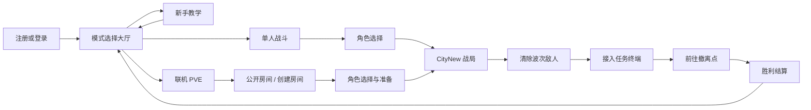
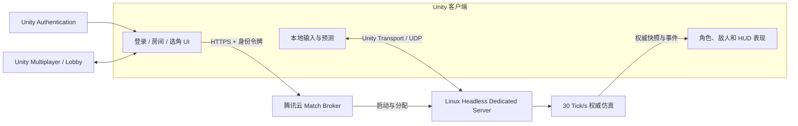

# FPS PVE Demo

> 基于 Unity 6 开发的第一人称 Roguelite PVE 演示项目，覆盖新手教学、单人战斗、双人联机、服务器权威同步、敌人 AI、背包与成长、存档恢复以及可复现性能测试。

[](https://unity.com/)
[](https://github.com/zongjunlv/FPS/releases/latest)
[](https://github.com/zongjunlv/FPS/actions/workflows/unity-quality-gate.yml)
[](https://github.com/zongjunlv/FPS/releases/latest)

## 项目简介

这是一个面向客户端开发岗位展示的可运行 FPS 垂直切片。项目不是单独堆叠功能的练习场，而是围绕“登录—选择模式—进入战局—完成目标—结算或退出”的完整用户流程组织系统，并为单机与联机玩法复用同一套战斗规则、敌人配置和 CityNew 任务内容。

项目重点不只在玩法数量，也包括工程化落地：领域程序集拆分、固定 Tick 权威仿真、Unity Netcode for GameObjects、Linux Headless Dedicated Server、对象池、AI 分帧预算、Job/Burst、Addressables、版本化存档、自动化测试和多进程网络验收。

### 当前可体验内容

| 模式 | 内容 | 状态 |
| --- | --- | --- |
| 新手教学 | 移动、跳跃、冲刺、下蹲、射击、ADS、点射、连射、换弹和切枪教学 | 可运行 |
| 单人战斗 | 波次清敌、终端交互、撤离、升级选卡、经验、背包、掉落和结算 | 可运行 |
| 联机 PVE | 登录、公开房间、创建/加入、选角、准备、双人共同通关 | 可运行 |
| 联机测试 | 房间最多两人；房主单人准备后也可开始，便于独立验收 | 可运行 |

## 下载客户端

当前 Windows 客户端版本为 **v0.2.0 Windows x86_64**；macOS 客户端继续提供 **v0.1.0 Universal**，同时支持 Apple Silicon 与 Intel Mac。

- [前往 Releases 页面](https://github.com/zongjunlv/FPS/releases/latest)
- [直接下载 Windows x86_64 客户端](https://github.com/zongjunlv/FPS/releases/download/v0.2.0/FPS-PVE-Demo-v0.2.0-Windows-x86_64.zip)
- [直接下载 macOS 客户端](https://github.com/zongjunlv/FPS/releases/download/v0.1.0/FPS-PVE-Demo-v0.1.0-macOS-universal.zip)
- macOS SHA-256：`4621702e0740dfa21127979f342629b2bdc914c489ce511677163f3907756520`

Windows 解压后运行 `FPS-PVE-Demo.exe`；请保留 EXE、`FPS-PVE-Demo_Data`、`UnityPlayer.dll` 和 `MonoBleedingEdge` 在同一目录。macOS 解压后运行 `FPS-PVE-Demo.app`；当前 macOS 客户端采用 ad-hoc 签名，尚未经过 Apple 公证，如果首次启动被 Gatekeeper 拦截，请在 Finder 中右键应用并选择“打开”。联机模式依赖网络服务，公开服务可能因维护临时不可用。

## 完整游戏流程



教学、单人和联机战局均可通过 ESC 菜单中途退出并返回模式大厅，不需要强制完成当前关卡。

## 核心玩法

### 第一人称战斗

- AR 与手枪两套武器状态，支持切枪、弹匣/备弹、换弹打断和射击节奏约束。
- Hitscan 命中判定配合高速曳光、枪口焰、弹孔、材质火花、空间音效和受击反馈。
- 腰射与 ADS 使用不同散布和后坐力反馈，移动与连续开火会影响稳定性。
- 玩家拥有生命与护甲，HUD 同步显示武器、弹药、任务、波次、经验和消耗品。
- Concrete、Metal、敌人不同受击区域使用独立反馈；敌人支持部位伤害和死亡效果。

### 波次、肉鸽成长与背包

- 数据驱动的定量波次生成、并发上限、剩余数量和阶段推进。
- 击杀获得经验并触发升级选卡，卡牌支持生命、护甲、射速等可叠加成长。
- Gameplay Effect 支持 `Add`、`Multiply`、`Override` 聚合、持续效果、条件效果和安全回滚。
- 消耗品背包支持堆叠、拆分、自动整理、拖拽换位、拖出丢弃、世界掉落与快捷使用。
- ESC 菜单统一提供继续、保存、读取、开始新战局和退出到模式大厅。

### 敌人 AI

- 巡逻、可疑、警戒、搜索、追击和攻击状态形成完整感知闭环。
- 视觉与枪声感知相互衔接，失去目标后能够搜索并恢复巡逻，避免状态永久卡死。
- Assault、Raider、Support、Suppressor、Elite 等职责采用差异化移动、侧翼、支援和压制策略。
- Utility AI 输出候选行为分数和选择原因，可通过运行时诊断面板观察决策过程。
- 头顶信息只保留轻量血条与当前状态；对象回收时同步清理状态、效果和显示实例。

## 联机架构

联机模式不是本地 Host 冒充服务器。客户端负责输入、预测与表现，腾讯云上的 Linux Headless Dedicated Server 负责权威战局；匹配代理负责为房间分配独立服务器进程和短时连接票据。



服务器权威范围包括：

- 玩家连接准入、身份与版本兼容校验；
- 移动、射击频率、命中、伤害和死亡；
- 敌人生命周期、波次、任务阶段、掉落和结算；
- 命令反重放、非法状态拒绝、断线清理与重连恢复；
- 客户端预测校正、插值与网络诊断数据。

房间上限为两人，所有已加入玩家完成选角并准备后由房主开始。为便于功能验证，只有房主一人时也允许创建并启动联机战局。

更详细的权威规则和多进程验收边界见：

- [权威战局仿真内核](docs/architecture/authoritative-simulation.md)
- [服务器权威双人合作与网络诊断](docs/networking/issue-65.md)
- [Dedicated Server + 双客户端多进程验收](docs/networking/issue-100.md)

## 工程架构

项目通过 Assembly Definition 明确模块边界，领域层不依赖 Unity 场景对象，表现与基础设施通过组合根接入。

```text
FPS.Core / Combat / AI / Inventory / SaveGame
                    │
                    ├── FPS.GameplayEffects
                    ├── FPS.Simulation（无 Unity 引擎依赖）
                    ├── FPS.Networking.Domain（无 Unity 引擎依赖）
                    │       ├── Networking.Netcode
                    │       ├── Networking.Session
                    │       └── Networking.Diagnostics
                    └── FPS.Composition / UI / HybridEcs
```

| 方向 | 实现 |
| --- | --- |
| 场景与资源 | Addressables、运行时工厂、对象池、资源内容校验 |
| 战斗规则 | 统一伤害协议、Gameplay Effect、命中事件与表现解耦 |
| 战局仿真 | 30 Tick/s 固定步进、命令序列、权威快照、确定性事件 |
| 网络同步 | NGO、Unity Transport、客户端预测、校正、插值、重连 |
| AI | FSM + Utility AI、NavMesh、空间查询、感知预算、Job/Burst |
| 数据安全 | 存档版本校验、稳定 ID、SHA-256 完整性校验 |
| 可观测性 | AI 决策面板、战局调试时间轴、网络指标与性能 JSON 报告 |

## 性能与验证

项目保留原始 JSON、运行条件与负面结果，不只记录“优化后更快”的结论。

- 战斗特效、曳光、弹孔、音效 Voice 与敌人实例采用固定容量预热池，稳定采样期避免反复 `Instantiate/Destroy`。
- 视觉感知使用预算化轮询，近距离敌人优先；批量预判通过 Job/Burst 执行。
- 100 敌人压力场景固定分辨率、种子、预热和采样时长，并记录平均帧时间、P95/P99、主线程、GC 与感知延迟。
- AI LOD 在相同 100 敌人场景中将中位平均帧时间从 `14.39 ms` 降至 `10.51 ms`，P95 从 `48.30 ms` 降至 `29.49 ms`。
- 混合 ECS 路径在 300/500 敌人时平均 Step 分别下降 `31.1%` 和 `43.7%`，但在 100 敌人档回退 `14.1%`，未通过硬门禁，因此当前正式玩法仍保留 GameObject 路径。
- 针对 Retina 4K 全屏瓶颈，独立 Player 默认使用等比例约 1080p 像素预算，可显式切换原生分辨率进行对照。

原始条件、限制与报告：

- [战斗对象池与感知预算](docs/performance/issue-13.md)
- [100 敌人可复现基线](docs/performance/issue-30.md)
- [AI LOD 对照实验](docs/performance/issue-42.md)
- [空间索引负面结果](docs/performance/issue-43.md)
- [Job/Burst 视线批处理](docs/performance/issue-44.md)
- [GameObject 与混合 ECS 决策门禁](docs/performance/issue-64.md)

## 技术栈

| 分类 | 版本 / 方案 |
| --- | --- |
| 引擎 | Unity `6000.5.3f1`、C# |
| 渲染 | Universal Render Pipeline `17.5.0` |
| 输入 | Input System `1.19.0` |
| 导航 | AI Navigation `2.0.13`、NavMesh |
| 联机 | Netcode for GameObjects `2.13.2`、Unity Transport、UGS Authentication / Multiplayer |
| 数据与资源 | Addressables `2.10.3`、JSON、ScriptableObject |
| 性能 | Burst `1.8.29`、Collections / Entities `6.5.0`、ProfilerRecorder |
| 测试 | Unity Test Framework `1.7.0`、Python 验收与报告门禁 |
| 服务端 | Unity Linux Headless Dedicated Server、systemd、HTTPS Match Broker |

## 操作说明

| 操作 | 键位 |
| --- | --- |
| 移动 | `WASD` |
| 观察 | 鼠标移动 |
| 跳跃 | `Space` |
| 冲刺 | `Left Shift` |
| 下蹲 / 站立 | `C` |
| 射击 | 鼠标左键 |
| ADS 瞄准 | 鼠标右键 |
| 换弹 | `R` |
| 切换主 / 副武器 | `1` / `2` 或鼠标滚轮 |
| 交互 | `E` |
| 拾取世界物品 | `F` |
| 打开背包 | `Tab` |
| 快捷使用消耗品 | `4` / `5` |
| 暂停与战局菜单 | `Esc` |

## 从源码运行

### 环境要求

- Unity `6000.5.3f1`；
- macOS 或安装了对应 Build Support 的桌面平台；
- Git LFS 不是必需项，资源均随仓库正常检出；
- 联机模式需要可访问 Unity Services 与项目配置的远程匹配服务。

### 启动项目

1. 克隆仓库并使用 Unity Hub 添加项目根目录。
2. 使用 Unity `6000.5.3f1` 打开项目，等待 Package Manager 与资源导入完成。
3. 打开 `Assets/Scenes/Modes/ModeEntry.unity`。
4. 进入 Play Mode，从登录界面开始完整流程。

构建设置中的场景顺序为：

```text
ModeEntry → Tutorial → BattlePreparation → CoopLogin → CityNew
```

### 无界面构建

项目支持 Unity CLI 后台构建，不需要打开编辑器窗口：

```bash
unity build . \
  --target StandaloneOSX \
  --output-path ./Builds/FPS-PVE-Demo.app \
  --provenance-path ./Builds/build-provenance-macos.json \
  --timeout 3600
```

## 自动化质量门禁

关闭正在占用项目的 Unity Editor 后运行：

```bash
./scripts/ci/run-unity-quality-gate.sh all
```

统一入口依次执行内容校验、编译检查、EditMode 与 PlayMode 测试，并输出 XML、JSON、Markdown 和原始日志。GitHub Actions 使用同一脚本，另外执行离线平衡、100 敌人性能回归以及 Dedicated Server + 双客户端多进程验收。

详细说明见 [Unity 自动化质量门禁](docs/quality-gate.md)。

## 项目结构

```text
Assets/
├── Scenes/Modes/                 # 登录、模式大厅、教学与角色选择场景
├── Scripts/
│   ├── AI/                       # 状态机、Utility AI、感知与混合 ECS
│   ├── Combat/                   # 伤害、武器、命中和战斗反馈
│   ├── GameplayEffects/          # 属性聚合、持续/条件效果
│   ├── Inventory/                # 背包、消耗品和世界掉落
│   ├── Networking/               # Domain、Netcode、Session、Diagnostics
│   ├── SaveGame/                 # 战局快照与恢复
│   ├── Simulation/               # 固定 Tick 权威战局内核
│   └── UI/                       # HUD 与通用界面基础设施
├── Tests/                        # EditMode、PlayMode 与内容验证
└── ThirdParty/                   # 带独立授权文件的第三方资源
docs/                             # 架构、性能、网络与验收报告
scripts/                          # CI、性能、平衡和远程服务工具
Tools/Networking/                 # 多进程构建与验收入口
deploy/dedicated-server/          # Linux 服务端部署模板
```

## 当前限制与后续计划

- 公开 Release 当前仅提供 macOS Universal 客户端，Windows Build Support 安装完成后会补充 Windows 版本。
- macOS 客户端尚未使用 Apple Developer ID 公证签名。
- 联机玩法当前以双人 PVE 为目标，不包含大规模匹配、观战和竞技反作弊。
- 混合 ECS 仍是可切换实验路径；在全部硬门禁通过前不会替换正式 GameObject AI。

## 第三方资源

- [Kenney Blocky Characters](https://kenney.nl/)：CC0；
- [Kenney Game Icons](https://kenney.nl/assets/game-icons)：CC0，用于账号、模式选择与联机大厅图标；
- [Quaternius Sci-Fi Essentials / Universal Animation Library / Universal Base Characters](https://quaternius.com/)：各资源目录内附授权文件；
- [Singularity — vitalezzz](https://opengameart.org/content/singularity-0)：CC0，项目内记录见 [音频来源与校验](docs/audio/Singularity.md)；
- 其他导入资源以其随包授权和说明文件为准。

本仓库代码未单独声明开源许可证；第三方素材仍分别遵循其原始授权条款。
